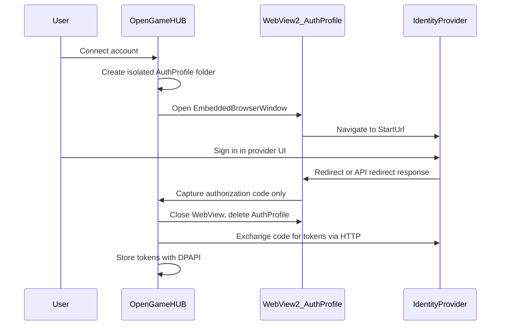

# Auth browser security model

OpenGameHUB uses an embedded **WebView2** window only for **OAuth login** with external platforms (Microsoft/Xbox, Epic). The browser exists to let the user sign in on the provider’s pages; the app never reads usernames or passwords and never injects script into those pages.

This document explains **what we defend against**, **how each control is implemented**, and **whether it matches common secure practice** for desktop launchers.

---

## Threat model (what we care about)

| Threat                         | Goal                                                                                                            |
| ------------------------------ | --------------------------------------------------------------------------------------------------------------- |
| **Session bleed**              | Auth cookies must not mix with the user’s normal Edge profile or persist longer than needed.                    |
| **Open navigation**            | A compromised or malicious page must not redirect the WebView to arbitrary URLs (phishing, token exfiltration). |
| **Bridge attacks**             | Web pages must not call into .NET (`AddHostObjectToScript`) or run our code via `ExecuteScriptAsync`.           |
| **Over-collection**            | We must not scrape credentials, form fields, or page DOM—only the OAuth **authorization code** at the callback. |
| **Secret storage**             | Tokens and API keys must not sit in plaintext `settings.json` or SQLite.                                        |
| **Expanded attack surface**    | DevTools, downloads, pop-ups, and keyboard shortcuts are unnecessary for login and increase risk.               |
| **Binary reverse engineering** | Embedded `client_id` values are public by design; **client secrets must never ship in the app**.                |

We do **not** try to make WebView2 “as safe as a static web page.” We try to make it **as small and short-lived as possible** for one job: complete OAuth and close.

---

## Architecture (happy path)

**Entry points**

| Platform         | Service                              | Strategy                                                           |
| ---------------- | ------------------------------------ | ------------------------------------------------------------------ |
| Xbox / Microsoft | `XboxAuthService.SignInAsync`        | `XboxAuthCaptureStrategy`                                          |
| Epic             | `SettingsViewModel.ConnectEpicAsync` | `EpicAuthCaptureStrategy` → `LegendaryClient.RunAuthWithCodeAsync` |

**Core files**

| Area                 | Files                                                                     |
| -------------------- | ------------------------------------------------------------------------- |
| Browser host         | `Views/EmbeddedBrowser/WebView2Host.cs`                                   |
| Session profile      | `Infrastructure/Browser/WebView2AuthProfile.cs`                           |
| Domain policy        | `Infrastructure/Browser/AuthHostPolicy.cs`                                |
| Orchestration        | `Services/Auth/EmbeddedBrowserService.cs`                                 |
| Per-provider capture | `Services/Auth/*AuthCaptureStrategy.cs`                                   |
| UI                   | `ViewModels/EmbeddedBrowserViewModel.cs`, `Views/EmbeddedBrowserWindow.*` |

**Fallback when WebView2 runtime is missing**

- **Xbox:** system browser + manual paste (`XboxPasteAuthWindow`) — same code extraction, worse UX, user must not paste URLs into untrusted places.
- **Epic:** `legendary auth` opens its own browser flow.

**Steam** is intentionally **not** handled in the embedded browser. There is no standard OAuth callback for “create API key”; setup stays manual (open page, paste key). See [storage-and-settings.md](storage-and-settings.md).

---

## Controls vs. vulnerabilities

### 1. Isolated WebView2 profile

**Risk:** Reusing the user’s Edge profile would expose existing cookies, extensions, and saved passwords to the login surface (and leave auth cookies behind after logout).

**Implementation**

- Each auth session uses `%LocalAppData%\OpenGameHUB\AuthProfile\{guid}\` via `WebView2AuthProfile.CreateSessionFolder()`.
- `CoreWebView2Environment.CreateAsync(null, userDataFolder)` — **not** the shared Evergreen user profile.
- Folder is deleted in a `finally` block after the dialog closes (`DeleteSessionFolder`), success or cancel.

---

### 2. Domain allowlist

**Risk:** After login, providers redirect across several hosts; without a bound, a bug or malicious content could navigate to an attacker URL inside our WebView.

**Implementation**

- Each `IAuthCaptureStrategy` defines `AllowedHosts`.
- `WebView2Host` cancels `NavigationStarting` when `AuthHostPolicy.IsHostAllowed` fails (exact host or `*.allowed` suffix).
- `WebResourceResponseReceived` ignores responses from non-allowed hosts.

**Current allowlists**

| Provider | Hosts                                                                                                 |
| -------- | ----------------------------------------------------------------------------------------------------- |
| Xbox     | `login.live.com`, `login.microsoftonline.com`, `account.live.com`, `signup.live.com`, `microsoft.com` |
| Epic     | `legendary.gl`, `epicgames.com`, `unrealengine.com`                                                   |

---

### 3. No JavaScript injection

**Risk:** `ExecuteScriptAsync` / `AddScriptToExecuteOnDocumentCreated` let our app run code in the page context—useful for scraping but dangerous if the page is hostile and increases blast radius.

**Implementation**

- `ExecuteScriptAsync` is **not exposed** on `WebView2Host`.
- `IAuthCaptureStrategy` has no DOM capture path.
- Epic’s `authorizationCode` is read from the **HTTP response body** of the provider redirect (`WebResourceResponseReceived` → `TryCaptureFromResponse`), not from `document.body`.

---

### 4. No .NET host objects

**Risk:** `AddHostObjectToScript` exposes arbitrary .NET surface to JavaScript (historical RCE/phishing vectors in embedded browsers).

**Implementation**

- Never called; documented in `WebView2Host.InitializeAsync`.
- No host object registration API is wrapped.

---

### 5. Capture only the OAuth callback

**Risk:** Reading the whole page or arbitrary URLs can pull PII or unrelated tokens.

**Implementation**

| Provider | Capture point                                             | What is extracted                                                  |
| -------- | --------------------------------------------------------- | ------------------------------------------------------------------ |
| Xbox     | Navigation to `login.live.com/oauth20_desktop.srf?code=…` | Query param `code` (`XboxAuthService.TryExtractAuthorizationCode`) |
| Epic     | Response to URL containing `/id/api/redirect`             | JSON field `authorizationCode` only                                |

After capture, the dialog closes immediately; token exchange runs **outside** the WebView (`XboxAccountClient.CompleteLoginAsync`, `legendary auth --code`).

**Not in scope:** Steam API keys, cookies, refresh tokens from the WebView, or form fields.

---

### 6. Never store user credentials

**Risk:** Logging or persisting username/password from the login form.

**Implementation**

- Strategies return only `string` authorization codes (or null).
- No code path reads password inputs or general page content.
- `IAuthCaptureStrategy` is documented to forbid returning credentials.

**Practice?** Yes — desktop apps should use OAuth and treat the IdP login form as a black box.

---

### 7. Token storage (DPAPI)

**Risk:** Tokens in `settings.json`, SQLite, or logs are readable by other users/processes or leak in backups.

**Implementation**

| Secret                           | Store                                       | Mechanism                                          |
| -------------------------------- | ------------------------------------------- | -------------------------------------------------- |
| Xbox Live / XSTS tokens          | `%LocalAppData%\OpenGameHUB\xbox\*.dat`     | `XboxTokenStore` — DPAPI `CurrentUser`             |
| Steam API key, IGDB, SteamGridDB | `%LocalAppData%\OpenGameHUB\secrets.dat`    | `SettingsSecretsStore` — DPAPI                     |
| Epic session for CLI             | `%USERPROFILE%\.config\legendary\user.json` | **Managed by legendary** (not DPAPI-wrapped by us) |
| Epic display metadata            | `settings.json`                             | Account id + display name only (no tokens)         |

After OAuth, Xbox tokens never pass through the WebView layer again.

---

### 8. Minimal browser surface

**Risk:** DevTools, downloads, new windows, and context menus let users or scripts exfiltrate data or debug sensitive sessions.

**Implementation** (`WebView2Host` settings and handlers)

| Feature                                 | Setting / handler                          |
| --------------------------------------- | ------------------------------------------ |
| DevTools                                | `AreDevToolsEnabled = false`               |
| Context menu                            | `AreDefaultContextMenusEnabled = false`    |
| Accelerator keys (F12, etc.)            | `AreBrowserAcceleratorKeysEnabled = false` |
| Status bar / zoom / built-in error page | Disabled                                   |
| New window / tab                        | `NewWindowRequested` → `Handled = true`    |
| Downloads                               | `DownloadStarting` → `Cancel = true`       |

Script dialogs remain enabled so legitimate IdP pages that use `alert`/`confirm` still work.

---

### 9. No embedded client secrets (critical)

**Risk:** Shipping `client_secret` or HTTP Basic credentials in the binary allows anyone with a disassembler to impersonate the app.

**Implementation**

- Xbox uses a **public** desktop `client_id` with the standard Microsoft redirect (`oauth20_desktop.srf`) — no secret in `XboxAccountClient`.
- Epic auth delegates token exchange to **legendary**, which implements Epic’s public client flow.
- Steam Web API key is **user-generated** and stored in DPAPI after manual entry—not embedded.

---

## Is this “secure practice” overall?

**For a Windows game launcher: yes, this is a reasonable and common baseline**, aligned with how many apps implement “Sign in with …” using WebView2 or system browser:

- Short-lived, isolated browser profile  
- Allowlisted navigation  
- OAuth code only, exchanged over HTTPS in native code  
- Windows DPAPI for app-held secrets  
- No script bridge to .NET

It is **not** a substitute for a full security audit or formal threat model sign-off.

### What we do well

- Treats WebView2 as a **disposable OAuth shell**, not a general browser.
- Avoids the highest-risk embedded-browser patterns (host objects, JS scraping, shared profile).
- Keeps long-lived secrets in DPAPI stores documented in [storage-and-settings.md](storage-and-settings.md).

### Known gaps and hardening opportunities

| Gap                                                 | Severity   | Notes                                                                                                                                              |
| --------------------------------------------------- | ---------- | -------------------------------------------------------------------------------------------------------------------------------------------------- |
| **No** `state` **/ PKCE in our Xbox authorize URL** | Medium     | Microsoft desktop flow often omits PKCE; adding `state` would improve CSRF binding for custom redirect handlers. Evaluate against Live OAuth docs. |
| **Broad allowlist entries** (`microsoft.com`)       | Low–medium | Prefer minimal host sets per provider documentation.                                                                                               |
| **Epic tokens in legendary** `user.json`            | Medium     | Outside our DPAPI layer; users with malware on the same account can read user files. Same as any legendary user.                                   |
| **Response body capture (Epic)**                    | Low        | Mitigated by path filter `/id/api/redirect`; still depends on TLS and correct host allowlist.                                                      |
| **Fallback: paste URL (Xbox)**                      | Low (UX)   | User could paste a malicious URL; we only parse `code=` with a strict regex on expected host patterns when pasted manually.                        |
| **No certificate pinning** on token HTTP            | Low        | Standard for desktop; relies on OS TLS stack.                                                                                                      |
| **Client id visible in binary**                     | Accepted   | Expected for public clients; do **not** add secrets to “compensate.”                                                                               |
| **WebView2 runtime trust**                          | Accepted   | We depend on Microsoft’s Evergreen runtime updates.                                                                                                |

### Steam

Steam library setup **deliberately** does not use the auth browser: API keys are user-issued secrets, not OAuth codes. That avoids DOM scraping and reduces WebView exposure. Trade-off: more manual steps for the user.

---

## Operational notes for developers

1. **Do not** add `ExecuteScriptAsync`, `AddHostObjectToScript`, or DOM scraping to auth strategies without a security review.
2. **Do not** widen `AllowedHosts` without checking provider redirect documentation.
3. **Do not** persist `%LocalAppData%\OpenGameHUB\AuthProfile\` across sessions unless there is a strong reason; deletion limits cookie lifetime.
4. **Do not** log authorization codes, refresh tokens, or API keys.
5. New platform OAuth should implement `IAuthCaptureStrategy` with **navigation- or redirect-response-only** capture, then exchange the code in existing HTTP/CLI clients.
6. Package layout: only `Microsoft.Web.WebView2.Core.dll` is deployed; WinForms/WPF WebView2 assemblies are excluded from build output to avoid accidental assembly probing (see `OpenGameHUB.csproj`).

---

## Related docs

- [storage-and-settings.md](storage-and-settings.md) — DPAPI paths for `secrets.dat` and Xbox tokens  
- [epic-and-legendary.md](epic-and-legendary.md) — Epic CLI auth and cloud library  
- [xbox.md](xbox.md) — Xbox account and catalog APIs  
- [ui-and-viewmodels.md](ui-and-viewmodels.md) — Settings and onboarding windows

